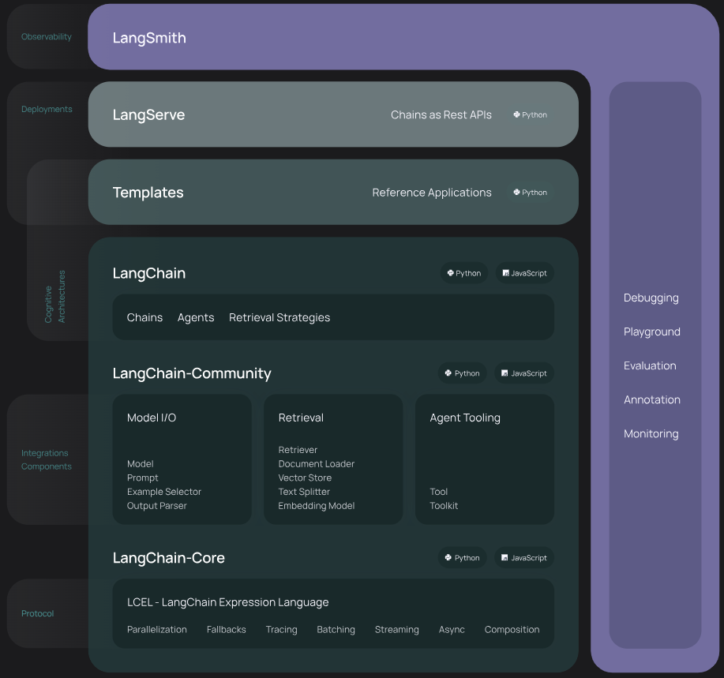
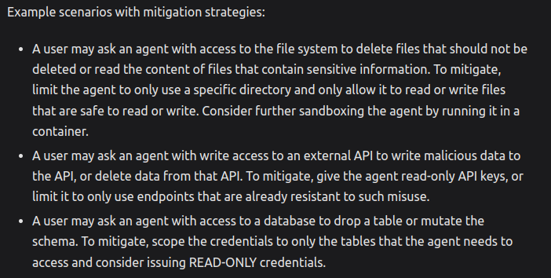
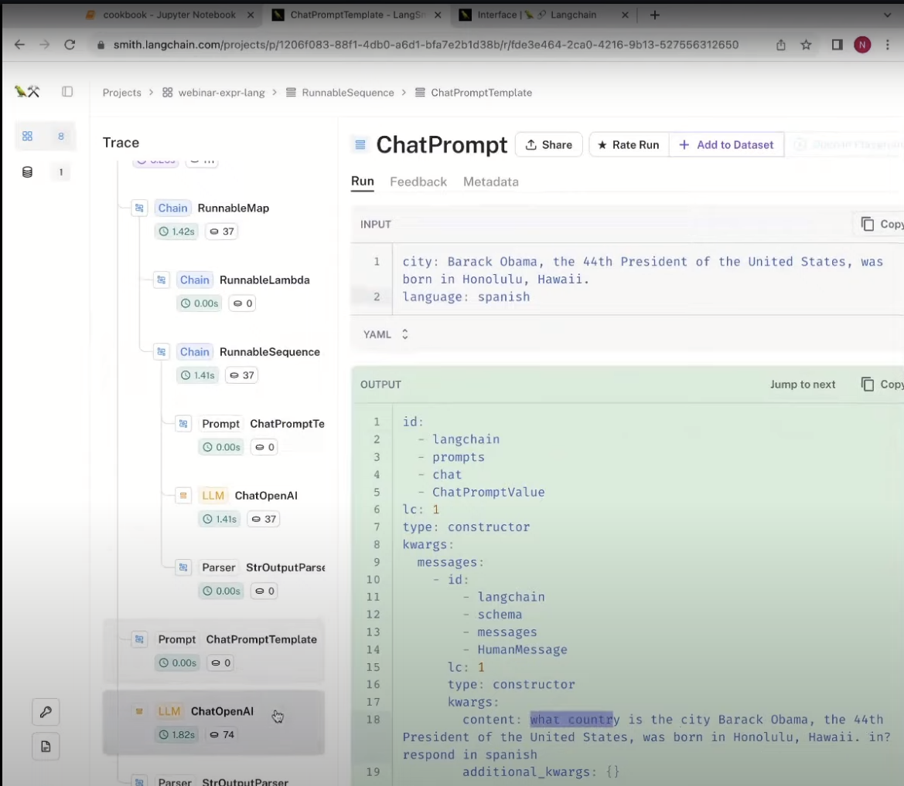

# What is langchain_expression_language?

It's basically a really amazing ORM for query across multiple GenAI workflows.

[Reddit post about LangChain being Pointless](https://www.reddit.com/r/LangChain/comments/13fcw36/langchain_is_pointless/)

It is not. It's an AMAZING ORM. Now a temporary opinion, it's better than llama-index which is a chaos of sub-dependancies.



Installation

pip install langchain

ALwAys use LangSmith : https://python.langchain.com/docs/get_started/quickstart#langsmith

Sandbox your dev environment :
Docker/Kubernetes for Local/Remote
Singularity/Slurm for HPC

e.g.



Security is important :

https://python.langchain.com/docs/security

When building such applications developers should remember to follow good security practices:

Limit Permissions:
Scope permissions specifically to the application's need. Granting broad or excessive permissions can introduce significant security vulnerabilities. To avoid such vulnerabilities, consider using read-only credentials, disallowing access to sensitive resources, using sandboxing techniques (such as running inside a container), etc. as appropriate for your application.

Anticipate Potential Misuse:
Just as humans can err, so can Large Language Models (LLMs). Always assume that any system access or credentials may be used in any way allowed by the permissions they are assigned. For example, if a pair of database credentials allows deleting data, it’s safest to assume that any LLM able to use those credentials may in fact delete data.

Defense in Depth:
No security technique is perfect. Fine-tuning and good chain design can reduce, but not eliminate, the odds that a Large Language Model (LLM) may make a mistake. It’s best to combine multiple layered security approaches rather than relying on any single layer of defense to ensure security. For example: use both read-only permissions and sandboxing to ensure that LLMs are only able to access data that is explicitly meant for them to use.



Environment Varibales for `.env. file :

Get Keys by SIGNING UP AT :

```
export LANGCHAIN_TRACING_V2="true"
export LANGCHAIN_API_KEY="..."
```

Building with LangChain :

pip install langchain-openai

export OPENAI_API_KEY="..."
